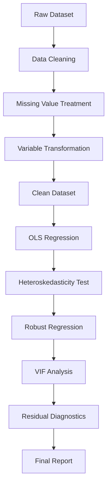

# 📈 Determinants of Stock Market Development

An econometric analysis of the factors influencing stock market activity across 24 countries using World Bank data and Ordinary Least Squares (OLS) regression.


---

## 📖 Overview

Stock markets are a vital component of economic development, facilitating capital formation, resource allocation, and wealth creation. Understanding the factors that influence stock market activity can help policymakers design strategies that encourage investment and improve financial market participation.

This project investigates the determinants of stock market development using cross-country data obtained from the World Bank's World Development Indicators (WDI) database. The study examines how income levels, taxation, employment, technological penetration, and market depth influence the total value of stocks traded within an economy.

The analysis employs Ordinary Least Squares (OLS) regression along with diagnostic tests for heteroskedasticity, multicollinearity, and residual normality to ensure robust and reliable results.

---

## 🎯 Research Objective

The objective of this study is to identify and quantify the impact of key economic and financial variables on stock market activity.

### Research Question

> What economic and financial factors significantly influence stock market development across countries?

---

## 🌍 Dataset

### Data Source

The dataset was obtained from the **World Bank World Development Indicators (WDI)** database.

https://databank.worldbank.org/source/world-development-indicators

### Countries Included

- Argentina
- Australia
- Austria
- Canada
- China
- Egypt
- France
- Germany
- India
- Italy
- Japan
- Malaysia
- Mexico
- New Zealand
- Norway
- Oman
- Russia
- Saudi Arabia
- Singapore
- South Africa
- Switzerland
- United Arab Emirates
- United Kingdom
- United States

### Dataset Information

- 24 Countries
- 600 Observations
- Cross-country panel dataset
- Multiple years of observations

---

## 📊 Variables Used

### Dependent Variable

| Variable | Description |
|-----------|-------------|
| `stock_value` | Total value of stocks traded (Current US$) |

### Independent Variables

| Variable | Description |
|-----------|-------------|
| `adj_income` | Adjusted Net National Income per Capita |
| `taxes_income` | Taxes on Income, Profits and Capital Gains (%) |
| `listed_companies` | Number of Domestically Listed Companies |
| `mobile_subs` | Mobile Cellular Subscriptions |
| `employment_ratio` | Employment-to-Population Ratio |

---

## 🛠 Methodology

### Data Cleaning

The raw dataset underwent several preprocessing steps before statistical analysis:

- Converted missing value placeholders (`..`) into Stata missing values
- Converted string variables into numeric format
- Standardized variable names
- Removed redundant variables
- Sorted observations by country and year
- Removed duplicate observations

### Missing Value Treatment

Different imputation techniques were used depending on the nature of the variable.

| Method | Application |
|----------|-------------|
| Manual Imputation | Countries with zero capital gains tax (UAE, Oman) |
| Interpolation | Mobile subscriptions, employment ratio, adjusted income |
| Regression Imputation | Taxes on income |
| Median Imputation | Listed companies |

### Logarithmic Transformation

To reduce skewness and improve interpretability, logarithmic transformations were applied:

```stata
gen log_stock = log(stock_value)
gen log_income = log(adj_income)
```

Benefits include:

- Reduced skewness
- Lower sensitivity to outliers
- Improved model stability
- Elasticity-based interpretation of coefficients

---

## 📐 Econometric Model

The regression model used in the study is:

$begin:math:display$
\\log\(stock\\\_value\)
\=
\\beta\_0
\+
\\beta\_1 \\log\(adj\\\_income\)
\+
\\beta\_2 employment\\\_ratio
\+
\\beta\_3 mobile\\\_subs
\+
\\beta\_4 taxes\\\_income
\+
\\beta\_5 listed\\\_companies
\+
\\epsilon
$end:math:display$

### Why OLS?

OLS was selected because it:

- Provides interpretable coefficient estimates
- Supports multiple explanatory variables
- Allows hypothesis testing
- Is widely used in economics and finance
- Performs well with large datasets

---

## 🔍 Model Diagnostics

### Heteroskedasticity Test

Breusch–Pagan / Cook–Weisberg Test

| Statistic | Value |
|------------|--------|
| Chi-square | 4.38 |
| p-value | 0.0364 |

#### Conclusion

The null hypothesis of homoscedasticity was rejected.

As a result, the model was re-estimated using **robust standard errors**.

---

### Multicollinearity Test

Variance Inflation Factor (VIF)

| Variable | VIF |
|-----------|------|
| Listed Companies | 2.43 |
| Mobile Subs | 2.33 |
| Log Income | 1.43 |
| Taxes Income | 1.35 |
| Employment Ratio | 1.33 |

**Mean VIF = 1.77**

#### Conclusion

All VIF values are below 5, indicating no significant multicollinearity issues.

---

### Residual Analysis

Residuals were analyzed using a histogram to assess normality.

Key observations:

- Residuals are approximately centered around zero
- Distribution resembles a bell curve
- Mild deviations from symmetry exist
- OLS assumptions are reasonably satisfied

---

## 📈 Results

### Model Performance

| Metric | Value |
|----------|---------|
| Observations | 600 |
| R² | 0.451 |
| Root MSE | 1.782 |

The model explains approximately **45.1%** of the variation in stock market activity.

---

## 🔑 Key Findings

### 1. Income Levels (`log_income`)

**Effect:** Positive and Highly Significant

A 1% increase in adjusted income per capita is associated with approximately a **0.93% increase** in stock value traded.

**Implication:** Higher incomes increase investment capacity and participation in financial markets.

---

### 2. Employment Ratio (`employment_ratio`)

**Effect:** Negative and Significant

Higher employment levels are associated with lower stock market activity after controlling for other variables.

Possible explanations include differences in sectoral employment composition and investment behavior across economies.

---

### 3. Mobile Subscriptions (`mobile_subs`)

**Effect:** Positive and Significant

Greater technological penetration is associated with increased stock market participation by improving access to information and digital trading platforms.

---

### 4. Taxes on Income (`taxes_income`)

**Effect:** Positive but Statistically Insignificant

The study does not find strong evidence that taxation significantly affects stock market activity within the scope of the model.

---

### 5. Listed Companies (`listed_companies`)

**Effect:** Positive and Highly Significant

A greater number of listed companies contributes to higher stock market activity through improved market depth and liquidity.

---

## 🏛 Policy Recommendations

Based on the findings, the following policy measures are recommended:

### Improve Income Levels

- Promote long-term investment incentives
- Encourage savings and wealth creation
- Support sustainable income growth

### Enhance Financial Literacy

- Introduce investment education programs
- Improve investor awareness
- Expand financial literacy initiatives

### Expand Digital Access

- Improve internet connectivity
- Support fintech innovation
- Increase access to digital financial services

### Strengthen Capital Markets

- Simplify listing requirements
- Encourage SME participation in stock exchanges
- Reduce compliance costs for firms

### Improve Tax Policy Stability

- Maintain transparent taxation frameworks
- Reduce uncertainty in capital gains taxation
- Encourage investor confidence

### Increase Market Participation

- Promote employment-linked investment programs
- Encourage retirement and investment savings schemes

---

## 🚧 Limitations

The study has several limitations:

- Limited number of explanatory variables
- Potential omitted variable bias
- Relatively short observation period
- Possible endogeneity concerns
- Use of pooled OLS instead of advanced panel-data techniques

---

## 🔮 Future Improvements

Potential extensions of this research include:

- Fixed Effects Models
- Random Effects Models
- Instrumental Variable Regression
- Dynamic Panel Models
- Inclusion of inflation and interest rates
- Financial literacy indicators
- Institutional quality measures

---

## 📂 Repository Structure

```text
Determinants-of-Stock-Market-Development/
│
├── README.md
├── Report.pdf
│
├── data/
│   ├── Raw DataSet1.dta
│   └── Clean DataSet1.dta
│
└── scripts/
    ├── Data Cleaning.do
    └── Data Processing.do
```

---

## 🚀 Reproducing the Analysis

### Requirements

- Stata 16 or later

### Step 1: Data Cleaning

Run:

```stata
do "Data Cleaning.do"
```

This script:

- Cleans the raw dataset
- Handles missing values
- Applies imputation methods
- Creates the cleaned dataset

### Step 2: Statistical Analysis

Run:

```stata
do "Data Processing.do"
```

This script:

- Performs variable transformations
- Runs OLS regression
- Conducts diagnostic testing
- Generates statistical results

---

## 📊 Project Workflow



---

## 📚 References

1. World Bank World Development Indicators (WDI)  
   https://databank.worldbank.org/source/world-development-indicators

---

## 👥 Authors

- Aneesh Nitin Bhate
- Aashish Pendharkar
- Arnav Jain
- Aryan Tripathi
- Arnav Tripathi
- Atharva Agrawal
- Sanjay Saini

**Course:** HS163 – Basic Econometrics  
**Institution:** Indian Institute of Technology Guwahati  
**Academic Year:** 2025–26

---

## 📄 License

This project was developed as part of the coursework requirements for **HS163: Basic Econometrics** at **IIT Guwahati** and is intended for academic and educational purposes.
